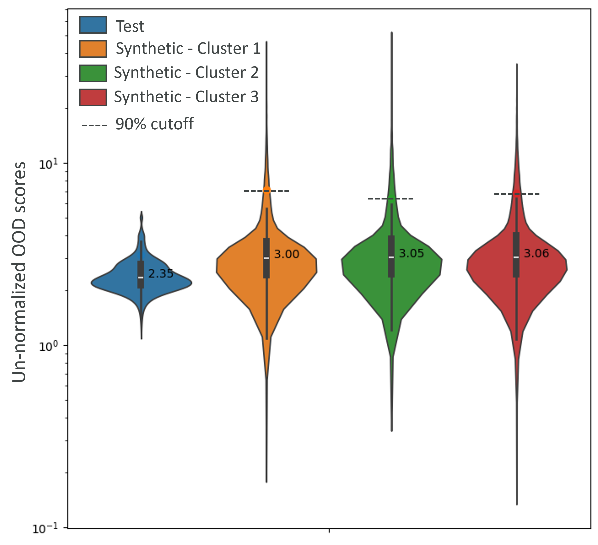
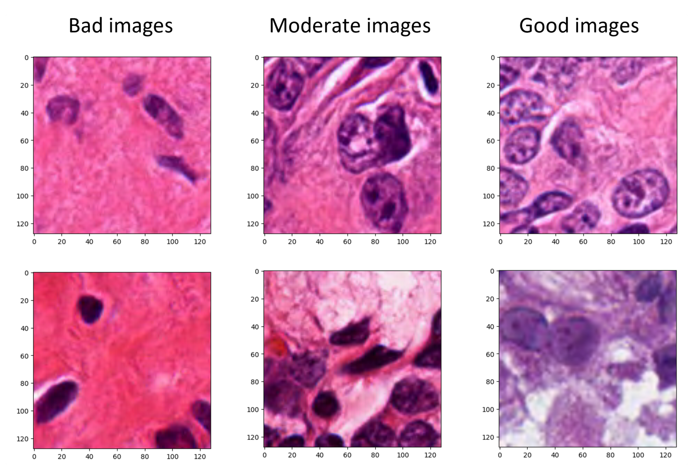
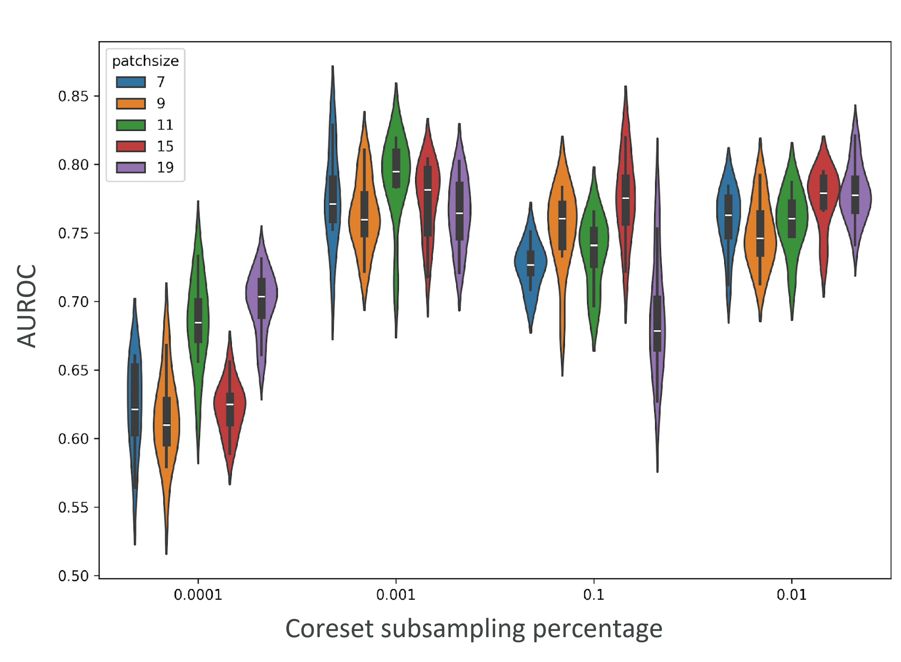

# Detecting OOD synthetic H&E images

This repository was made for the [MoNuSeg diffusion model](https://github.com/suren3141/semantic-diffusion-model). This part of the code performs OOD filtering steps.

This repository is an extension of `PatchCore` as proposed in Roth et al. (2021), <https://arxiv.org/abs/2106.08265> applied for OOD detection of synthetic histopathological images.

## Step-by-step instruction

### Data preparation

Download the data following the instructions in the [MoNuSeg Dataset](https://github.com/suren3141/MoNuSegDataset) repository.

Then create a new data directory in this project with the name `monuseg` with `train` and `test` subdirectories.
The train directory should only have real images in a folder named `gt`. The test directory can contain real images in a folder `gt` and synthetic images in a folder `syn`.
The images should be of `.png` format and can either be copied or soft linked.

```
monuseg
├── train
│   └── gt
│       ├──img1.png
│       ├──img2.png
│       ├──
│       ├──dir1
│
├── test
    ├── gt
    │   ├──img1.png
    │   ├──img2.png
    │   ├──
    │   ├──dir2
    │
    └── syn
        ├──dir3
        ├──dir4
        ├──dir5

```

### Installation

Build the docker image and then run it as follows.

```shell
docker build -t patchcore -f Dockerfile .

docker run --gpus all --rm -it -v $PATH_TO_DATASET:/mnt/dataset --name patchcore patchcore bash
```

Alternatively install the necessary packages manually without docker by using the [requirements](./requirements.txt) file.

### Training

To train the patchcore model with H-Optimus-0 backbone use the [run_patchcore](./bin/run_patchcore.py) script

```shell
python bin/run_patchcore.py 
results \
--gpu 0 --seed 0 \
--save_patchcore_model \
--log_group IM224_OPT_P01_D1024-1024_PS-3_AN-1_S0 --log_project MoNuSeg_Results \
patch_core -b optimus -le out --faiss_on_gpu \
--pretrain_embed_dimension 1024  --target_embed_dimension 1024 --anomaly_scorer_num_nn 1 --patchsize 3 \
sampler -p 0.1 approx_greedy_coreset \
dataset --resize 224 --imagesize 224 monuseg $PATH_TO_DATASET
```

`$PATH_TO_DATASET` refers to the folder that was created in the data preparation step with train adn test sets.

Set the `--save_segmentation_images` flag to save sample output anomaly maps.

Refer [sample_training.sh](./sample_training.sh) for other examples with different backbones.

### Evaluation

To evaluate on a pretrained model use the [load_and_evaluate_patchcore](./bin/load_and_evaluate_patchcore.py) script


```shell
python bin/load_and_evaluate_patchcore.py \
$RESULTS_PATH --gpu 0 --seed 0 --save_anomaly_scores \
patch_core_loader -p $MODEL_PATH --faiss_on_gpu \
dataset --resize 224 --imagesize 224 monuseg $PATH_TO_TEST_SET
```

Set the `--save_segmentation_images` flag to save sample output anomaly maps.

### Hyperparameter Tuning

To Hyperparameter Tuning script is based on train and evaluation scripts. The model is trained on the training set once and evaluated on the test set multiple times. Use the  on a pretrained model use the [hyperparam_opt_patchcore](./bin/hyperparam_opt_patchcore.py) script

### Visualization

The anomaly scores for each set can be visualized using the [analysis.ipynb](./notebooks/analysis.ipynb) script. It also displays sample images with corresponding anomaly values.

| OOD scores | Samples |
|---------|----------|
|  |  |


AUROC for hyperparameter tuning can be visualized using [hyperparam.ipynb](./notebooks/hyperparam.ipynb).




<!-- It also provides various pretrained models that can achieve up to _99.6%_ image-level anomaly
detection AUROC, _98.4%_ pixel-level anomaly localization AUROC and _>95%_ PRO score (although the
later metric is not included for license reasons).


_For questions & feedback, please reach out to suren.sritharan@tum.de_

---

## Quick Guide

First, clone this repository and set the `PYTHONPATH` environment variable with `env PYTHONPATH=src python bin/run_patchcore.py`.
To train PatchCore on MVTec AD (as described below), run

```
datapath=/path_to_mvtec_folder/mvtec datasets=('bottle' 'cable' 'capsule' 'carpet' 'grid' 'hazelnut'
'leather' 'metal_nut' 'pill' 'screw' 'tile' 'toothbrush' 'transistor' 'wood' 'zipper')
dataset_flags=($(for dataset in "${datasets[@]}"; do echo '-d '$dataset; done))


python bin/run_patchcore.py --gpu 0 --seed 0 --save_patchcore_model \
--log_group IM224_WR50_L2-3_P01_D1024-1024_PS-3_AN-1_S0 --log_online --log_project MVTecAD_Results results \
patch_core -b wideresnet50 -le layer2 -le layer3 --faiss_on_gpu \
--pretrain_embed_dimension 1024  --target_embed_dimension 1024 --anomaly_scorer_num_nn 1 --patchsize 3 \
sampler -p 0.1 approx_greedy_coreset dataset --resize 256 --imagesize 224 "${dataset_flags[@]}" mvtec $datapath
```

which runs PatchCore on MVTec images of sizes 224x224 using a WideResNet50-backbone pretrained on
ImageNet. For other sample runs with different backbones, larger images or ensembles, see
`sample_training.sh`.

Given a pretrained PatchCore model (or models for all MVTec AD subdatasets), these can be evaluated using

```shell
datapath=/path_to_mvtec_folder/mvtec
loadpath=/path_to_pretrained_patchcores_models
modelfolder=IM224_WR50_L2-3_P001_D1024-1024_PS-3_AN-1_S0
savefolder=evaluated_results'/'$modelfolder

datasets=('bottle'  'cable'  'capsule'  'carpet'  'grid'  'hazelnut' 'leather'  'metal_nut'  'pill' 'screw' 'tile' 'toothbrush' 'transistor' 'wood' 'zipper')
dataset_flags=($(for dataset in "${datasets[@]}"; do echo '-d '$dataset; done))
model_flags=($(for dataset in "${datasets[@]}"; do echo '-p '$loadpath'/'$modelfolder'/models/mvtec_'$dataset; done))

python bin/load_and_evaluate_patchcore.py --gpu 0 --seed 0 $savefolder \
patch_core_loader "${model_flags[@]}" --faiss_on_gpu \
dataset --resize 366 --imagesize 320 "${dataset_flags[@]}" mvtec $datapath
```

A set of pretrained PatchCores are hosted here: __add link__. To use them (and replicate training),
check out `sample_evaluation.sh` and `sample_training.sh`.

---

## In-Depth Description

### Requirements

Our results were computed using Python 3.8, with packages and respective version noted in
`requirements.txt`. In general, the majority of experiments should not exceed 11GB of GPU memory;
however using significantly large input images will incur higher memory cost.

### Setting up MVTec AD

To set up the main MVTec AD benchmark, download it from here: <https://www.mvtec.com/company/research/datasets/mvtec-ad>.
Place it in some location `datapath`. Make sure that it follows the following data tree:

```shell
mvtec
|-- bottle
|-----|----- ground_truth
|-----|----- test
|-----|--------|------ good
|-----|--------|------ broken_large
|-----|--------|------ ...
|-----|----- train
|-----|--------|------ good
|-- cable
|-- ...
```

containing in total 15 subdatasets: `bottle`, `cable`, `capsule`, `carpet`, `grid`, `hazelnut`,
`leather`, `metal_nut`, `pill`, `screw`, `tile`, `toothbrush`, `transistor`, `wood`, `zipper`.

### "Training" PatchCore

PatchCore extracts a (coreset-subsampled) memory of pretrained, locally aggregated training patch features:


To do so, we have provided `bin/run_patchcore.py`, which uses `click` to manage and aggregate input
arguments. This looks something like

```shell
python bin/run_patchcore.py \
--gpu <gpu_id> --seed <seed> # Set GPU-id & reproducibility seed.
--save_patchcore_model # If set, saves the patchcore model(s).
--log_online # If set, logs results to a Weights & Biases account.
--log_group IM224_WR50_L2-3_P01_D1024-1024_PS-3_AN-1_S0 --log_project MVTecAD_Results results # Logging details: Name of the run & Name of the overall project folder.

patch_core  # We now pass all PatchCore-related parameters.
-b wideresnet50  # Which backbone to use.
-le layer2 -le layer3 # Which layers to extract features from.
--faiss_on_gpu # If similarity-searches should be performed on GPU.
--pretrain_embed_dimension 1024  --target_embed_dimension 1024 # Dimensionality of features extracted from backbone layer(s) and final aggregated PatchCore Dimensionality
--anomaly_scorer_num_nn 1 --patchsize 3 # Num. nearest neighbours to use for anomaly detection & neighbourhoodsize for local aggregation.

sampler # We now pass all the (Coreset-)subsampling parameters.
-p 0.1 approx_greedy_coreset # Subsampling percentage & exact subsampling method.

dataset # We now pass all the Dataset-relevant parameters.
--resize 256 --imagesize 224 "${dataset_flags[@]}" mvtec $datapath # Initial resizing shape and final imagesize (centercropped) as well as the MVTec subdatasets to use.
```

Note that `sample_runs.sh` contains exemplary training runs to achieve strong AD performance. Due to
repository changes (& hardware differences), results may deviate slightly from those reported in the
paper, but should generally be very close or even better. As mentioned previously, for re-use and
replicability we have also provided several pretrained PatchCore models hosted at __add link__ -
download the folder, extract, and pass the model of your choice to
`bin/load_and_evaluate_patchcore.py` which showcases an exemplary evaluation process.

During (after) training, the following information will be stored:

```shell
|PatchCore model (if --save_patchcore_model is set)
|-- models
|-----|----- mvtec_bottle
|-----|-----------|------- nnscorer_search_index.faiss
|-----|-----------|------- patchcore_params.pkl
|-----|----- mvtec_cable
|-----|----- ...
|-- results.csv # Contains performance for each subdataset.

|Sample_segmentations (if --save_segmentation_images is set)
```

In addition to the main training process, we have also included Weights-&-Biases logging, which
allows you to log all training & test performances online to Weights-and-Biases servers
(<https://wandb.ai>). To use that, include the `--log_online` flag and provide your W&B key in
`run_patchcore.py > --log_wandb_key`.

Finally, due to the effectiveness and efficiency of PatchCore, we also incorporate the option to use
an ensemble of backbone networks and network featuremaps. For this, provide the list of backbones to
use (as listed in `/src/anomaly_detection/backbones.py`) with `-b <backbone` and, given their
ordering, denote the layers to extract with `-le idx.<layer_name>`. An example with three different
backbones would look something like

```shell
python bin/run_patchcore.py --gpu <gpu_id> --seed <seed> --save_patchcore_model --log_group <log_name> --log_online --log_project <log_project> results \

patch_core -b wideresnet101 -b resnext101 -b densenet201 -le 0.layer2 -le 0.layer3 -le 1.layer2 -le 1.layer3 -le 2.features.denseblock2 -le 2.features.denseblock3 --faiss_on_gpu \

--pretrain_embed_dimension 1024  --target_embed_dimension 384 --anomaly_scorer_num_nn 1 --patchsize 3 sampler -p 0.01 approx_greedy_coreset dataset --resize 256 --imagesize 224 "${dataset_flags[@]}" mvtec $datapath

```

When using `--save_patchcore_model`, in the case of ensembles, a respective ensemble of PatchCore parameters is stored.

### Evaluating a pretrained PatchCore model

To evaluate a/our pretrained PatchCore model(s), run

```shell
python bin/load_and_evaluate_patchcore.py --gpu <gpu_id> --seed <seed> $savefolder \
patch_core_loader "${model_flags[@]}" --faiss_on_gpu \
dataset --resize 366 --imagesize 320 "${dataset_flags[@]}" mvtec $datapath
```

assuming your pretrained model locations to be contained in `model_flags`; one for each subdataset
in `dataset_flags`. Results will then be stored in `savefolder`. Example model & dataset flags:

```shell
model_flags=('-p', 'path_to_mvtec_bottle_patchcore_model', '-p', 'path_to_mvtec_cable_patchcore_model', ...)
dataset_flags=('-d', 'bottle', '-d', 'cable', ...)
```

### Expected performance of pretrained models

While there may be minor changes in performance due to software & hardware differences, the provided
pretrained models should achieve the performances provided in their respective `results.csv`-files.
The mean performance (particularly for the baseline WR50 as well as the larger Ensemble model)
should look something like:

| Model | Mean AUROC | Mean Seg. AUROC | Mean PRO
|---|---|---|---|
| WR50-baseline | 99.2% | 98.1% | 94.4%
| Ensemble | __99.6%__ | __98.2%__ | __94.9%__

### Citing

The original implementation can be found in the [PathCore]() repository here.

If you use the code in this repository, please cite

```
@misc{roth2021total,
      title={Towards Total Recall in Industrial Anomaly Detection},
      author={Karsten Roth and Latha Pemula and Joaquin Zepeda and Bernhard Schölkopf and Thomas Brox and Peter Gehler},
      year={2021},
      eprint={2106.08265},
      archivePrefix={arXiv},
      primaryClass={cs.CV}
}
``` -->

<!-- ## License

This project is licensed under the Apache-2.0 License. -->
